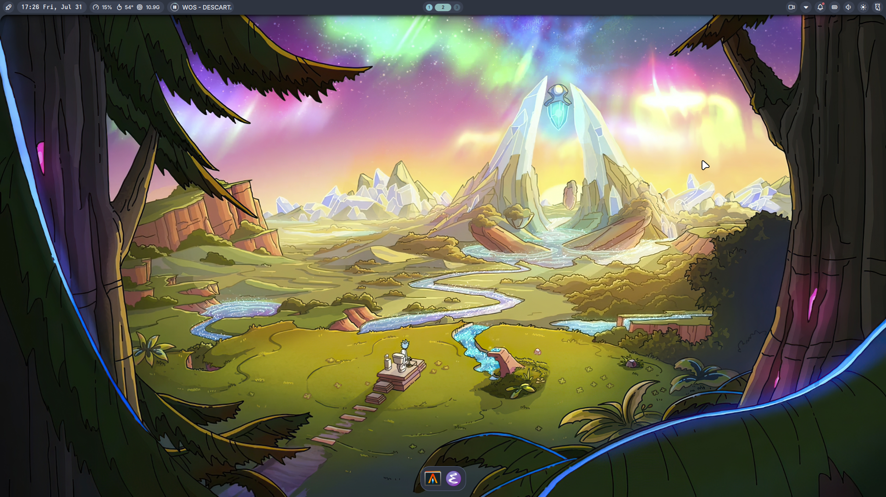
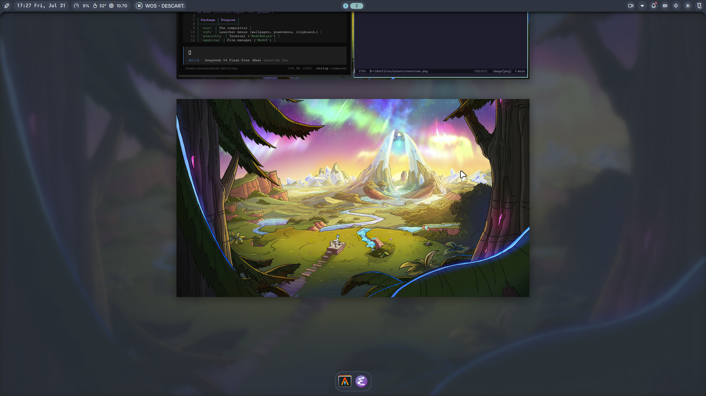
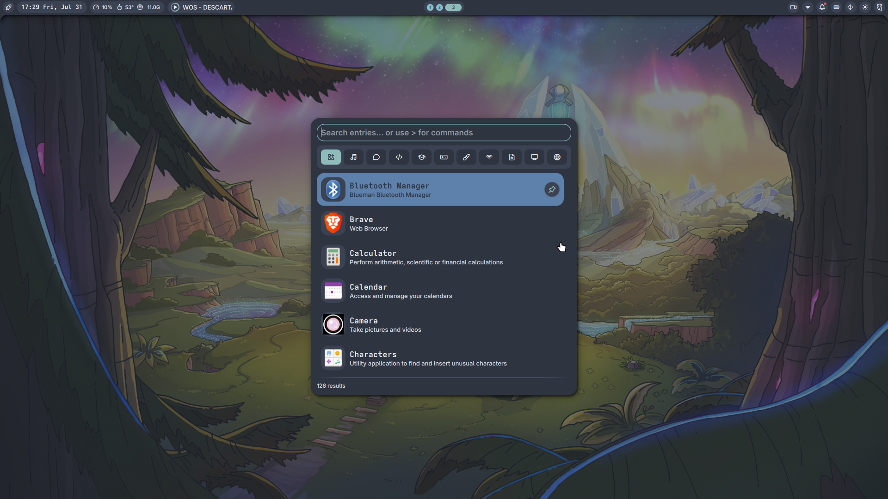
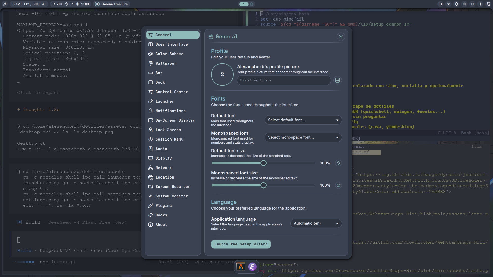

<div align="center">


<h3 align="center">
  
</h3>

<p align="center">
  Niri + noctalia-shell (Quickshell). Un rice modular y fácil de instalar.
</p>

</div><br>

<div align="center">

<a href="#Overview"><kbd> <br> Overview <br> </kbd></a>&ensp;&ensp;
<a href="#Screenshots"><kbd> <br> Screenshots <br> </kbd></a>&ensp;&ensp;
<a href="#Whatisthis"><kbd> <br> Whatisthis <br> </kbd></a>&ensp;&ensp;
<a href="#Documentation"><kbd> <br> Documentation <br> </kbd></a>&ensp;&ensp;
<a href="#QuickInstall"><kbd> <br> QuickInstall <br> </kbd></a>&ensp;&ensp;
<a href="#Updating"><kbd> <br> Updating <br> </kbd></a>&ensp;&ensp;
<a href="#Keybinds"><kbd> <br> Keybinds <br> </kbd></a>&ensp;&ensp;
<a href="#Troubleshooting"><kbd> <br> Troubleshooting <br> </kbd></a>&ensp;&ensp;
<a href="#Credits"><kbd> <br> Credits <br> </kbd></a>&ensp;&ensp;

<br/>
</div>

---

<a id="Overview"></a>


This repository contains a complete, modular [Niri](https://github.com/YaLTeR/niri) configuration featuring a [noctalia-shell](https://docs.noctalia.dev) — a Quickshell shell forked from end-4's illogical-impulse.

> [!CAUTION]
> **Hey.** This is my personal rice. I put effort into it, but it's not a product — don't expect hand-holding or stability guarantees. If you're just here because "it looks cool" and have no clue what Niri even is, maybe check out something more beginner-friendly first. Your system, your responsibility.

> **Heads up:** almost everything here is configurable. Modules, colors, fonts, animations — if something bugs you, there's probably a toggle for it. Hit `Mod+,` for settings before you rage-quit.

- **noctalia-shell** – bar, launcher, control center, lock screen, OSD, overview, notifications
- **Theming** – 10+ color scheme presets (Nord, Rose Pine, Catppuccin, Dracula…) with **matugen** pulling colors from your wallpaper
- **Overview** – Niri's workspace grid, bound to `Mod+Tab` (Windows-style `Win+Tab`)
- **Alt+Tab switcher** – with scopes: all windows, output, workspace, and app-id filtering
- **Launcher** – apps, clipboard history, emoji, calculator, commands
- **Wallpaper** – picker, random, and matugen re-themes everything automatically
- **Modes** – dev / gaming / music / normal (`Mod+F1..F4`), gaming mode kills gaps & animations
- **Focus-follows-mouse** – Hyprland-style, without scroll stealing
- **Optional emacs-config** – the installer asks if you want [alesanchezb/emacs-config](https://github.com/alesanchezb/emacs-config)

---

📸<a id="Screenshots"></a>


| Desktop | Overview |
|:---|:---|
|  |  |

| Launcher | Settings |
|:---|:---|
|  |  |

| Control Center |
|:---|
|  |

---

✨ <a id="Whatisthis"></a>


A shell on top of a scrollable tiling compositor. Bar at the top, panels that pop up when you press keys. The usual.

- **Bar** – workspaces, clock, tray, media, volume, WiFi, battery. Fully widget-based and configurable from the Settings GUI.
- **Launcher** – app grid with categories, clipboard history, emoji picker, calculator and command runner.
- **Overview** – workspace grid adapted for Niri's scrolling model.
- **Control Center** – quick toggles, notifications, media card, system monitor.
- **Settings** – GUI config with search, so you don't have to edit JSON like a caveman. Switch color schemes, bar widgets, wallpapers.
- **Theming** – presets like Nord and Rose Pine, or matugen generates a scheme from your current wallpaper. Fonts are customizable too.
- **OSD** – volume, brightness and media overlays that follow the shell's theme.
- **Lock screen** – themed lockscreen, bound to `Mod+L`.
- **Modes** – `Mod+F1` dev (launch editor), `Mod+F2` gaming (no gaps/animations via `modes/gaming.kdl`), `Mod+F3` music, `Mod+F4` back to normal.

### Packages in this repo

| Package | What it is |
|---------|-----------|
| `niri` | Compositor config: keybinds, layout, outputs, window rules, modes |
| `quickshell` | The noctalia-shell bar and panels |
| `rofi` | Menus for wallpaper, wallust themes, clipboard, powermenu… |
| `scripts` | Helper scripts (`~/.local/bin`): modes, wallpaper picker/random |
| `lib` | Shared logic for the setup scripts |

---

📦<a id="Documentation"></a>

Read these or suffer.

| Doc | What's in it |
|-----|--------------|
| [docs/INSTALL.md](docs/INSTALL.md) | How to install this thing, step by step |
| [docs/PACKAGES.md](docs/PACKAGES.md) | Every package the installer uses, by category |
| [docs/KEYBINDS.md](docs/KEYBINDS.md) | Default keyboard shortcuts |
| [docs/SETUP.md](docs/SETUP.md) | How the setup scripts work: install, uninstall, update, backups |
| [docs/niri-color-schemes.md](docs/niri-color-schemes.md) | The noctalia color presets available |

---

<a id="QuickInstall"></a>

Arch-based? Run this:

```bash
git clone https://github.com/alesanchezb/dotfiles-niri-config.git
cd dotfiles-niri-config
./install.sh
```

The installer asks if you want to pull in the [emacs-config](https://github.com/alesanchezb/emacs-config) too. Add `-y` to skip all prompts, `--no-aur` to skip AUR packages, `--full` for optional extras (cava, ytmdesktop).

Not on Arch? Check [docs/INSTALL.md](docs/INSTALL.md) for manual steps.

---

<a id="Updating"></a>

Already installed? Pull and sync:

```bash
cd dotfiles-niri-config
git pull
./update.sh
```

Re-links configs and hot-reloads niri. Add `--packages` to also update AUR packages. Your customizations stay.

---

## (the important ones)
🎹<a id="Keybinds"></a>

These come configured by default:

| Key | What it does |
|-----|--------------|
| `Mod+Tab` | Niri overview (`Win+Tab` style) |
| `Mod+Space` | Launcher |
| `Alt+Tab` | Window switcher (all windows) |
| `Alt+Shift+Tab` | Window switcher (current output) |
| `Ctrl+Alt+Tab` | Window switcher (current workspace) |
| `Mod+Return` | Terminal (alacritty) |
| `Mod+Q` | Close window |
| `Mod+W` | Toggle floating |
| `Alt+Return` | Fullscreen |
| `Mod+1..4` / `Mod+Shift+1..4` | Focus / move to workspace |
| `Mod+Ctrl+Tab` / `Mod+Shift+Tab` | Cycle workspaces |
| `Mod+H/J/K/Semicolon` | Move focus (Vim-ish) |
| `Mod+V` | Clipboard history |
| `Mod+C` | Calculator |
| `Mod+Ctrl+E` | Emoji picker |
| `Mod+,` | Settings |
| `Mod+Ctrl+K` | Keyboard shortcuts cheatsheet |
| `Mod+Ctrl+Q` | Session menu |
| `Mod+L` | Lock screen |
| `Mod+Shift+w` / `Mod+Ctrl+w` | Random / toggle wallpaper |
| `Mod+B` / `Mod+P` / `Mod+M` / `Mod+E` | Browser / Files / Spotify / Emacs |
| `Mod+F1..F4` | Modes: dev, gaming, music, normal |
| `Print` / `Ctrl+Print` / `Alt+Print` | Screenshot / screen / window |

Full list in [docs/KEYBINDS.md](docs/KEYBINDS.md).

---

## IPC (for nerds who want custom bindings)

noctalia-shell exposes IPC targets you can bind to whatever keys you want. Syntax:

```kdl
bind "Key" { spawn "qs" "-c" "noctalia-shell" "ipc" "call" "<target>" "<function>"; }
```

Main targets:

| Target | Functions |
|--------|-----------|
| `launcher` | `toggle`, `clipboard`, `calculator`, `emoji` |
| `wallpaper` | `random`, `toggle` |
| `settings` | `toggle` |
| `controlCenter` | `toggle` |
| `sessionMenu` | `toggle` |
| `lockScreen` | `lock` |
| `volume` | `increase`, `decrease`, `muteOutput` |
| `brightness` | `increase`, `decrease` |

---

🛠️<a id="Troubleshooting"></a>

Something broke? Shocking.

```bash
# Check the shell logs
qs log -c noctalia-shell

# Restart the shell without restarting Niri
qs kill -c noctalia-shell && qs -c noctalia-shell

# Validate the niri config
niri validate

# Nuclear option: reload everything
niri msg action load-config-file
```

If you're still stuck, the logs usually tell you what's missing. Usually.

---

## Fair warning

This is my daily driver. It works. Most of the time. I break things when I'm bored.

---

🙏<a id="Credits"></a>

- [**end-4**](https://github.com/end-4/dots-hyprland) – illogical-impulse for Hyprland
- [**noctalia**](https://docs.noctalia.dev) – the noctalia-shell
- [**Quickshell**](https://quickshell.outfoxxed.me/) – the framework that makes this possible
- [**YaLTeR**](https://github.com/YaLTeR/niri) – Niri, the compositor
- [**matugen**](https://github.com/InioX/matugen) – wallpaper-based color theming
- [**Community**](https://github.com/YaLTeR/niri) – Arch Linux, Niri and Quickshell communities

---

Made with ❤️ by alesanchezb. If you found this helpful, please consider giving it a star! It helps others discover this project.

## Star History
[](https://www.star-history.com/?repos=alesanchezb%2Fdotfiles-niri-config&type=date&legend=top-left)
