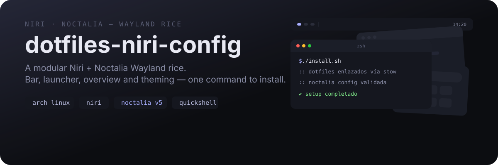
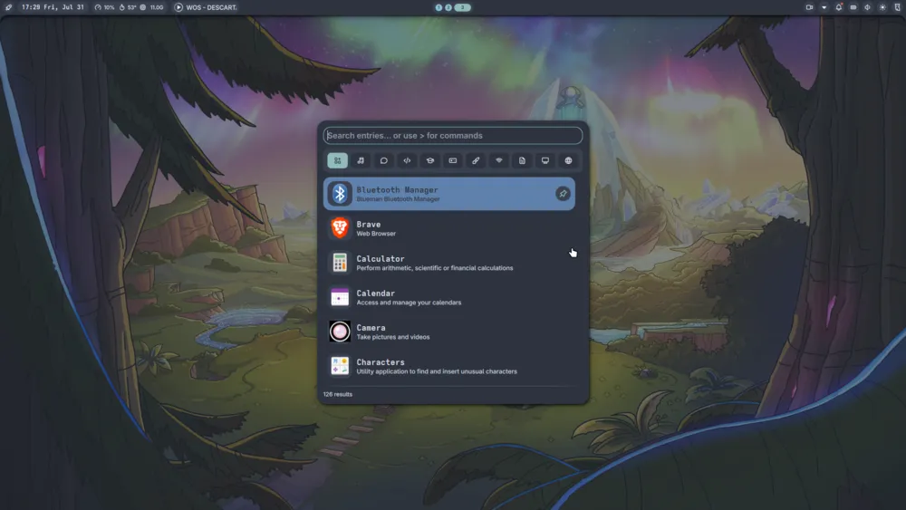
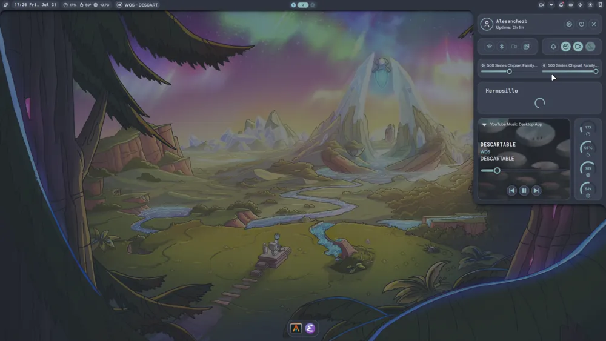
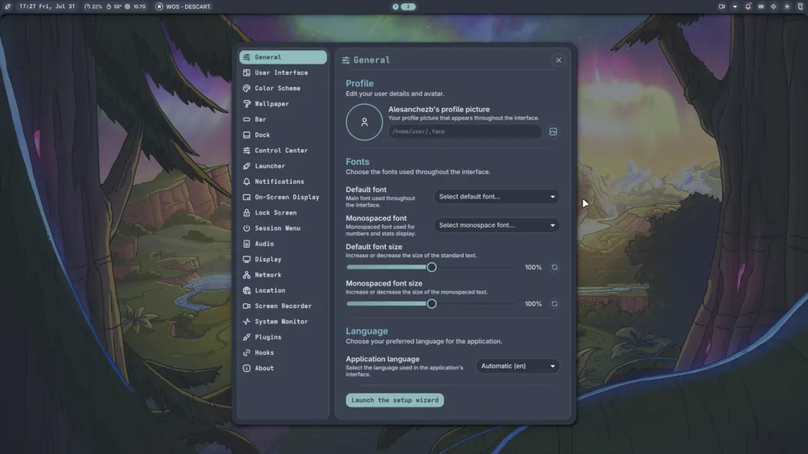

<div align="center">



**A complete, modular [Niri](https://github.com/YaLTeR/niri) setup with [Noctalia](https://noctalia.dev) —**
**bar, launcher, overview, lock screen and theming on top of a scrollable tiling compositor.**

<p>
  <a href="docs/INSTALL.md">Install</a> ·
  <a href="docs/KEYBINDS.md">Keybinds</a> ·
  <a href="docs/SETUP.md">Setup</a> ·
  <a href="docs/PACKAGES.md">Packages</a>
</p>

</div>

---

> [!CAUTION]
> **Personal rice.** It works — most of the time. It's not a product, so don't expect hand-holding or stability guarantees. Your system, your responsibility. Almost everything here is configurable: hit `Mod+,` for settings before you rage-quit.

## Screenshots

<p align="center">
  
</p>

| Overview | Launcher |
|:---|:---|
|  |  |

| Control Center | Settings |
|:---|:---|
|  |  |

## What's inside

- **noctalia v5** — bar, launcher, control center, lock screen, OSD, overview and notifications
- **Theming** — color presets (Nord, Rose Pine, Catppuccin, Dracula…) and **matugen** pulling colors from your wallpaper
- **Overview** — Niri's workspace grid, bound to `Mod+Tab` (Win+Tab style)
- **Alt+Tab switcher** — scopes for all windows, current output, workspace and app-id filtering
- **Launcher** — apps, clipboard history, emoji, calculator and command runner
- **Wallpaper** — picker, random and a **Wallhaven browser** (`Mod+Ctrl+t`)
- **Modes** — dev / gaming / music / normal (`Mod+F1..F4`); gaming mode kills gaps and animations
- **Focus-follows-mouse** — Hyprland-style, with smart column/workspace/monitor fallback (`niri-focus-*.sh`)

## Quick install

Arch-based:

```bash
git clone https://github.com/alesanchezb/dotfiles-niri-config.git
cd dotfiles-niri-config
./install.sh
```

- `-y` — assume yes, skip all prompts
- `--no-aur` — skip AUR packages
- `--full` — also install optional extras (cava, ytmdesktop)
- The installer asks if you want to pull in the optional [emacs-config](https://github.com/alesanchezb/emacs-config)

Not on Arch? See [docs/INSTALL.md](docs/INSTALL.md).

## Updating

```bash
cd dotfiles-niri-config
git pull
./update.sh        # re-links configs and hot-reloads niri
./update.sh --packages   # also updates AUR packages
```

Your customizations stay. Conflicts are backed up to `~/.dotfiles-backup/`.

## Keybinds (the important ones)

| Key | What it does |
|-----|--------------|
| `Mod+Return` | Terminal (alacritty) |
| `Mod+Space` | Launcher |
| `Mod+Tab` | Overview (Win+Tab style) |
| `Alt+Tab` | Window switcher (all windows) |
| `Mod+H/J/K/U` / `Mod+Semicolon` | Move focus (column / workspace / monitor) |
| `Mod+1..4` / `Mod+Shift+1..4` | Focus / move to workspace |
| `Mod+V` / `Mod+C` / `Mod+Ctrl+E` | Clipboard / Calculator / Emoji picker |
| `Mod+,` | Settings |
| `Mod+Ctrl+O` | Keyboard shortcuts cheatsheet |
| `Mod+Ctrl+Q` / `Mod+Backspace` | Session menu |
| `Mod+L` | Lock screen |
| `Mod+Shift+w` / `Mod+Ctrl+t` | Random wallpaper / Wallhaven browser |
| `Mod+B` / `Mod+P` / `Mod+M` / `Mod+E` | Browser / Files / Spotify / Emacs |
| `Mod+F1..F4` | Modes: dev, gaming, music, normal |
| `Print` / `Ctrl+Print` / `Alt+Print` | Screenshot / screen / window |

Full list in [docs/KEYBINDS.md](docs/KEYBINDS.md).

## IPC

Noctalia exposes IPC targets you can bind to any key. See `noctalia msg --help` for the full list; a few useful ones:

```kdl
bind "Key" { spawn-sh "noctalia msg panel-toggle launcher"; }
bind "Key" { spawn-sh "noctalia msg settings-toggle"; }
bind "Key" { spawn-sh "noctalia msg session lock"; }
bind "Key" { spawn-sh "noctalia msg plugins enable <author>/<plugin>"; }
```

## Docs

| Doc | What's in it |
|-----|--------------|
| [docs/INSTALL.md](docs/INSTALL.md) | Step-by-step install |
| [docs/PACKAGES.md](docs/PACKAGES.md) | Every package the installer uses, by category |
| [docs/KEYBINDS.md](docs/KEYBINDS.md) | All default shortcuts |
| [docs/SETUP.md](docs/SETUP.md) | How install / uninstall / update work |

## Credits

- [Noctalia](https://noctalia.dev) — the shell
- [Niri](https://github.com/YaLTeR/niri) — the compositor
- [matugen](https://github.com/InioX/matugen) — wallpaper-based color theming
- The Arch Linux, Niri and Noctalia communities